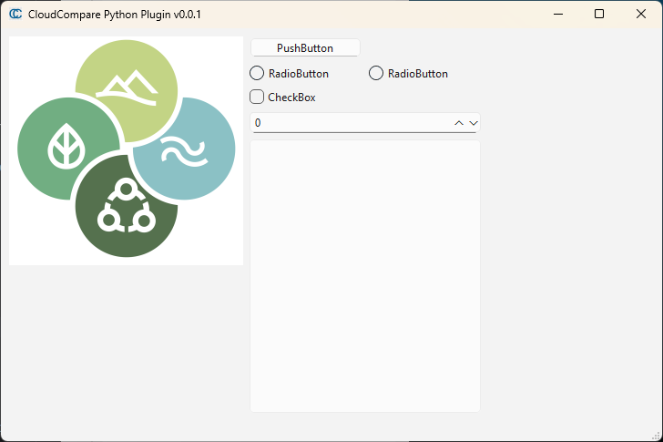

# cloudcompare_python_plugin



A simple demo plugin for CloudCompare-PythonRuntime with a Qt GUI (PySide6).

The entry point is defined in the `pyproject.toml` file. The plugin is autodiscovered by CloudCompare if installed using `pip`.

Inspired by the example from https://github.com/tmontaigu/CloudCompare-PythonRuntime

```toml
[project.entry-points."cloudcompare.plugins"]
cloudcompare_python_plugin = "cloudcompare_python_plugin.Plugin:Plugin"
```
-----

**Table of Contents**

- [Installation](#installation)
- [Documentation](#documentation)
- [License](#license)

## Installation

Install the package with `install.ps1` (requires administrator rights to install in the CloudCompare standard directory).

Or use the console. In this case, you may not be able to install in the correct location, the one where CloudCompare is looking for plugins.

```console
pip install cloudcompare_python_plugin
```

## Documentation

This is a very simple GUI with basic controls:
- Increment the spinbox when clicking on the button.
- Check the box to change the increment (unchecked => 1 / checked => 2).
- Click on the radio buttons to show a text in the editor.

Convert ui and qrc files with the `uic_rcc.py` script (uses uic.exe and rcc.exe as provided with PySide6).

## License

`cloudcompare_python_plugin` is distributed under the terms of the [GPL3+](https://spdx.org/licenses/GPL-3.0-or-later.html) license.
